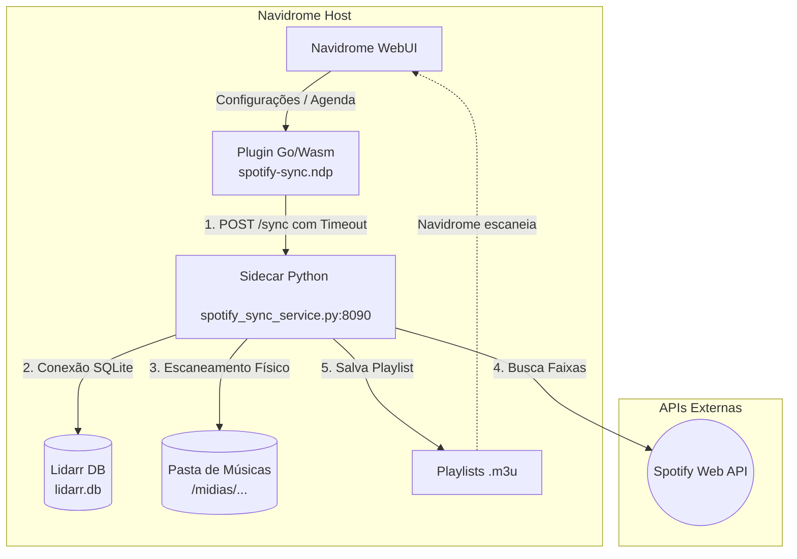

# Navidrome Spotify Sync Plugin (`spotify-sync`)

O **Navidrome Spotify Sync Plugin** é uma solução híbrida, resiliente e altamente automatizada projetada para integrar perfeitamente as suas playlists monitoradas do Spotify no Lidarr diretamente à biblioteca de áudio do seu servidor **Navidrome**.

O ecossistema é dividido em duas partes fundamentais para garantir a compatibilidade e a conformidade com as políticas de isolamento:
1. **Plugin NDP (`spotify-sync.ndp`)**: Um módulo compilado em WebAssembly (Wasm) carregado nativamente pelo Navidrome. Ele expõe campos de configuração no painel administrativo da WebUI do Navidrome e dispara tarefas agendadas (Cron) ou sob demanda.
2. **Serviço Sidecar (`spotify_sync_service.py`)**: Um microsserviço em Python executado diretamente no host ou container sidecar que realiza a leitura de dados do SQLite do Lidarr, conecta-se à API do Spotify usando chaves de fallback do próprio banco do Lidarr, escaneia arquivos locais e gera playlists `.m3u` compatíveis no diretório de músicas do Navidrome.

---

## 🛠️ Arquitetura e Fluxo de Dados

Abaixo, descrevemos o fluxo de execução de ponta a ponta, desde a configuração do administrador até a criação das playlists físicas em disco:



---

## 🚀 Guia de Instalação para Usuários Finais

Siga as etapas abaixo para instalar e colocar o plugin em produção no seu servidor Navidrome:

### Requisitos Prévios
* **Navidrome** com suporte a plugins ativado. Certifique-se de configurar a variável de ambiente:
  ```env
  ND_PLUGINS_ENABLED=true
  ```
* **Lidarr** instalado e funcional na mesma rede ou com acesso ao seu banco de dados SQLite (`lidarr.db`).
* **Python 3** instalado no host com suporte ao módulo `requests`.

---

### Passo 1: Instalação do Módulo NDP no Navidrome
1. Baixe ou gere o pacote pré-compilado `spotify-sync.ndp`.
2. Copie o arquivo `.ndp` para a pasta de plugins do seu Navidrome. Se você roda o Navidrome via Docker Compose, mapeie uma pasta para `/plugins`:
   ```bash
   cp spotify-sync.ndp /caminho/para/navidrome/plugins/
   ```
3. Garanta as permissões corretas no arquivo:
   ```bash
   chmod 644 /caminho/para/navidrome/plugins/spotify-sync.ndp
   ```
4. Reinicie o contêiner do Navidrome para carregar o plugin:
   ```bash
   docker restart navidrome
   ```

---

### Passo 2: Executar o Serviço Sidecar no Host
O serviço Python é o cérebro que interage com as APIs externas e lê o banco do Lidarr.
1. No seu servidor host, certifique-se de que a biblioteca `requests` está instalada:
   ```bash
   pip3 install requests
   ```
2. Inicie o script `spotify_sync_service.py` em segundo plano para que persista mesmo após você fechar o terminal:
   ```bash
   nohup python3 /app/volumes/navidrome/plugins/spotify_sync_service.py > /tmp/spotify_sync_service.log 2>&1 &
   ```
   *Nota: O sidecar escutará nativamente na porta `8090`.*
3. Para verificar se o serviço está executando corretamente, consulte os logs:
   ```bash
   tail -f /tmp/spotify_sync_service.log
   ```

---

### Passo 3: Configurar o Lidarr para Importar do Spotify
O plugin sidecar é automatizado! Ele lê o banco do Lidarr para descobrir quais playlists você deseja sincronizar. Para registrar uma playlist no Lidarr:
1. Acesse o painel do seu **Lidarr** (geralmente `http://<IP-DO-SERVIDOR>:8686`).
2. Vá em **Settings** > **Import Lists** e clique em **+** (Adicionar).
3. Selecione **Spotify Playlists**.
4. Configure:
   * **Name**: `Spotify Sync` (ou um nome de sua escolha).
   * **Authenticate**: Clique para autenticar com a sua conta do Spotify.
   * **Playlists**: Selecione as playlists que deseja monitorar (ex: `ANIPLAY2026`).
   * **Root Folder**: Escolha o diretório padrão onde o Lidarr organiza os downloads de música.
   * **Should Search**: Deixe marcado para que o Lidarr busque e baixe músicas que faltam no seu disco.
5. Salve a configuração. O Lidarr armazenará as credenciais do Spotify com segurança em seu banco.

---

### Passo 4: Configurar e Ativar o Plugin na WebUI do Navidrome
1. Faça login como **Administrador** no Navidrome.
2. Navegue até **Settings** > **Plugins**.
3. Localize o plugin **spotify-sync** e clique em **Configure**.
4. Preencha as propriedades necessárias:
   * **URL do Serviço Sidecar**: A URL interna ou externa do host (ex: `http://10.0.0.25:8090` ou `http://172.17.0.1:8090` se estiver usando o gateway do Docker).
   * **Hora de sincronização diária (0-23)**: O horário em formato 24h em que a sincronização periódica rodará automaticamente (ex: `2` para 2h da manhã).
   * **Sincronizar ao iniciar o Navidrome**: Defina como `true` (marcado) para que as playlists sejam atualizadas sempre que o Navidrome for reiniciado.
5. Marque a caixa **Enabled** do plugin e salve. Os logs do Navidrome devem exibir:
   ```
   Plugin Spotify Sync inicializado com sucesso!
   ```

---

## 🛠️ Guia de Compilação para Usuários Avançados

Se você deseja compilar o plugin WebAssembly a partir do código fonte, modificar as configurações internas ou customizar o comportamento do build, oferecemos um script automatizado que cuida de toda a toolchain via Docker e gerencia a ativação forçada de plugins no banco SQLite do Navidrome.

Para ver o guia passo a passo completo sobre compiladores, dependências locais/Docker e gerenciamento de versão, consulte o documento:
👉 **[COMPILING.md](file:///home/isa7q/navidrome-plugin-spotify-sync/COMPILING.md)**

---

## 💻 Manual de Manutenção do Código (Para Desenvolvedores)

Se você é um desenvolvedor responsável por expandir, depurar ou manter este projeto, por favor atente-se às decisões de arquitetura e lógicas de negócio descritas a seguir.

### 1. Isolamento de Rede no Runtime do Extism Wasm Sandbox
O runtime de execução de plugins do Navidrome utiliza **Extism**, rodando o código em WebAssembly (Wasm) sob regras estritas de sandbox.
* **Segurança HTTP**: Qualquer chamada HTTP feita de dentro do binário WASM (`host.HTTPSend`) para o mundo externo será barrada se o host remoto não estiver previamente declarado.
* **manifest.json**: Para que a comunicação com o sidecar ocorra com sucesso na rede interna do Docker ou do host físico, os IPs (como `10.0.0.25`, `172.17.0.1` ou `host.docker.internal`) devem estar expressamente autorizados no array `requiredHosts` dentro do [manifest.json](file:///home/isa7q/navidrome-plugin-spotify-sync/manifest.json). Se você mudar a subrede de rede do servidor, adicione o IP correspondente lá e recompile o plugin.

### 2. Resiliência do Sistema de Autenticação e Fallback de Tokens
A integração do Spotify tradicional requer autenticação manual contínua. Para contornar essa limitação e obter automação 100% autônoma (*hands-off*):
* O sidecar Python lê diretamente a tabela `ImportLists` do banco de dados `lidarr.db`.
* O script parseia todos os registros e extrai cada `refreshToken` configurado em qualquer integração do Spotify ativa no Lidarr.
* Quando uma sincronização é disparada, o script realiza a renovação através da API de proxy oficial do Lidarr (`https://spotify.lidarr.audio/renew`).
* **Fallback Rotativo**: Se um token falhar com erro `401 Unauthorized` ou de rede, o sidecar tenta sequencialmente os tokens de refresco das demais contas configuradas no Lidarr, evitando paradas se uma das contas expirar ou perder acesso.

### 3. Algoritmo Inteligente de Matching de Músicas
O cruzamento entre as faixas da playlist do Spotify e os arquivos locais de áudio é feito por meio de um algoritmo heurístico de pontuação (*scoring*):
* **Limpeza de Nomes (`clean_filename`)**: Remove prefixos de numeração de faixas (como `01. `, `CD1-02 `, `1-01 `) no início do arquivo físico para evitar que correspondências parciais deem preferência a faixas numéricas de outros álbuns.
* **Tradução Romaji ⇄ Kanji/Kana (`artist_mappings` e `title_mappings`)**: Mapeamento pré-definido de strings para cruzar nomes de artistas e faixas escritas em ideogramas japoneses (como `ずっと真夜中でいいのに。` ⇄ `ZUTOMAYO` ou `几田りら` ⇄ `Lilas`).
* **Regras de Pontuação**:
  * **Correspondência Exata**: O arquivo normalizado limpo correspondendo exatamente ao título do Spotify recebe **+50 pontos**.
  * **Remixes**: Arquivo com "remix" ou "mix" só pontua se a faixa do Spotify contiver explicitamente o termo. Caso contrário, perde **-30 pontos**.
  * **TV-Size**: Arquivo de tamanho de TV ("tv-size") é penalizado com **-40 pontos** se a música do Spotify for a versão completa.
  * **Instrumental / Karaoke**: Arquivos instrumentais ("instrumental", "off vocal", "karaoke") perdem **-80 pontos** se a faixa original do Spotify contiver vocais. Isso impede que o Navidrome inclua a faixa "off vocal" no lugar da versão principal.
  * **Diferença de Tamanho (String Similarity)**: Bônus de até **+20 pontos** se a string normalizada do nome do arquivo físico limpo tiver quase o mesmo tamanho do título original do Spotify (desempate fino).

### 4. Lock de Banco e Atualização Concorrente do SQLite
O banco de dados SQLite do Navidrome (`navidrome.db`) é altamente propenso a travamentos (`database is locked`) quando acessado concorrentemente em momentos em que o contêiner do Navidrome está subindo ou salvando cache na finalização.
* Se um plugin é reinstalado ou substituído, o Navidrome pode desabilitá-lo preventivamente no banco (`enabled = 0` na tabela `plugin`).
* Para reativá-lo via script sem causar corrupção, o fluxo ideal (implementado em `build.sh`) exige **parar o contêiner do Navidrome primeiro**, aplicar a query de atualização SQL no SQLite (`UPDATE plugin SET enabled = 1...`), e só então reiniciar o contêiner.

---

## 🔍 Visualização de Logs e Diagnóstico
* Logs do Sidecar Python (Host):
  ```bash
  cat /tmp/spotify_sync_service.log
  ```
* Logs do Navidrome (Filtro por Plugin):
  ```bash
  docker compose logs navidrome -f --no-color | grep -i "spotify"
  ```
